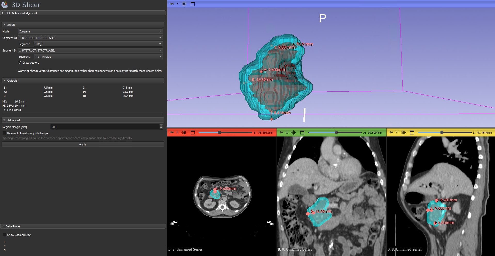
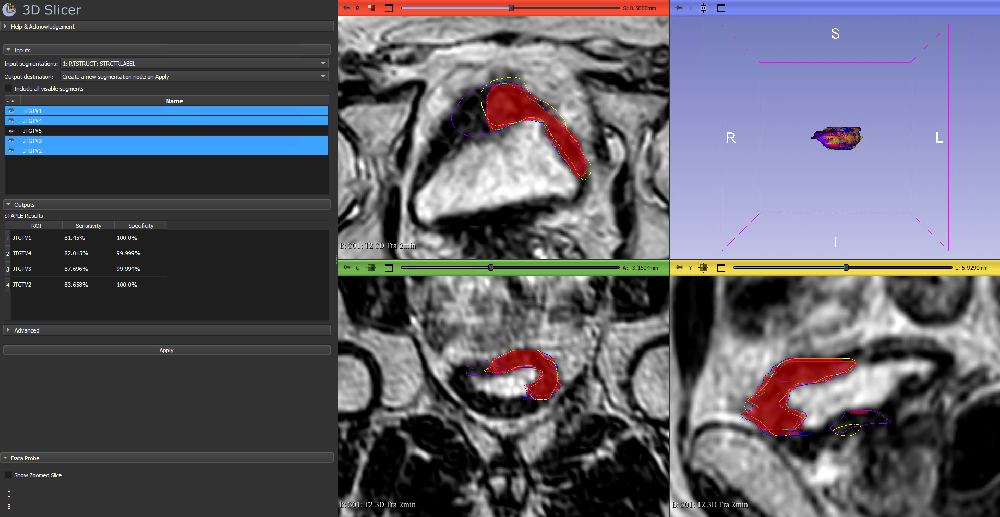

This extension contains two tool for comparing segmentations:
- Bidirectional Local Distance (BLD)
- Simultaneous Truth and Performance Level Estimation (STAPLE)

#  Bidirectional Local Distance

The module implments a bidirectional local distance (BLD) measure decomposed into cardinal directions. BLD is a robust surface distance metric.
For a full description see Kim et al (DOI:[10.1118/1.4754802](https://doi.org/10.1118/1.4754802)).

Brielfy, for two segments, A and B, the algorithm peforms the follwing steps:
1. Calculates nearest neighbour points on A from B and on B from A.
2. Walks A and checks if any points on B have the point on A as their nearest neighbour.
3. Takes the BLD vector for that point as the maximum magnitude between:
	- the vector to A's nearest neighbour on B, and
	- all the nearest neightbour vectors from B to that point on A.

This account for shortfalls in traditional minimum distance measure described in Kim at al and shown in the logo.

This module then decomposes the BLD metric into the 8 cardinal directions
- **S**uperior
- **I**nferior
- **A**nterior
- **P**osterior
- **L**eft
- **R**ight

This is done but taking subsets of the BLD vectors for points on A corresponding to direction regions. The direction region is defined by including all points within a margin of the most distal point in each direction. The size of the margin is adjustable from the advanced section.
For example, if a segment A's maximum x extents were -12mm and +5mm and a region margin of 5mm was selected then points with an x coordinate > 0mm would be included in the right region and < -7mm in the left region.

The distance for that region is then taken as the relevant maximum BLD vector component in that subregion.
The three modes dictate how the maximum is taken:
- **Compare**: the maximum magnitue vector component is taken
- **Grow**: the maximum distal component is taken
- **Shrink**: the maximum proximal component is taken

The Hausdorff distance (HD) is the calculated as the maximum BLD vector magnitude over the whole segment.
The 95th percentile Hausdorff distance (HD 95%) is taken as the 95th percentile BLD vector magnitude.

## Usage

To calculate the BLD:
1. Select the desired mode.
2. Select the two segments from their segemtnation nodes.
3. Click Apply.
4. The distances will be shown in the Outputs section when computed.

### Vector Drawing
To sense check the select BLD vectors, the draw vectors option can be used to plot each direction's selected maximum vector as a markdown.
*Note: the markdown shows the total distance ie, the BLD magnitude, rather than the component*

The markdown objects can be edited in Slicer but will be overwritten on each run.

### Resampling
If contours are very smooth then there may be a large distance between contour points and so discrepencies can occur.
To prevent this, the contour points can be resampled by converting to binary labelmaps and deleting the original representation.
This can greatly increase the number of contour points and so computation time can increase significantly.

*Warning, this means the original representation is lost!*

### File Output

To aid in data recording, the file output menu allows the data in the output table to be written to a CSV, Excel or Pandas Pickle file.
If the new file option is used then the file is named "BLD_Results".
If the append option is used then the file is read in, a new row is added and the file is overwritten.

#  STAPLE
This module exposes [SimpltITK's implmentation](https://simpleitk.org/doxygen/v2_5/html/classitk_1_1simple_1_1STAPLEImageFilter.html) of the Simultaneous Truth and Performance Level Estimation (STAPLE) aglorithm.
For a full description, see Warfield at al. (DOI:[10.1007/3-540-45786-0_37](https://doi.org/10.1007/3-540-45786-0_37)).
The STAPLE algorithm can be used for generating consensus contours from multiple observers.
This module can be used to generate STAPLE segmentations and gives feedback on the contriubtion of each observer.

## Usage

To run the algorithm:
1. Select the segmentation node that containes the segments.
2. Select where to put the resutling segmentation.
3. Either:
		- Include all visable segments.
		- Highlight the desired segments using Ctl/Shift+Click.
4. Select Apply

### Threshold
The STAPLE segmentation is generated by creating a probability map of the likelyhood a voxel will be in the segmentation.
By default, the STAPLE segmentation is taken by thresholding the probability map at 50% but this can be congifugred in the Advanced section.

# Test Data
Both modules can be tested using the TinyPatient dataset in Slicer's sample data (File>Download Sample Data).